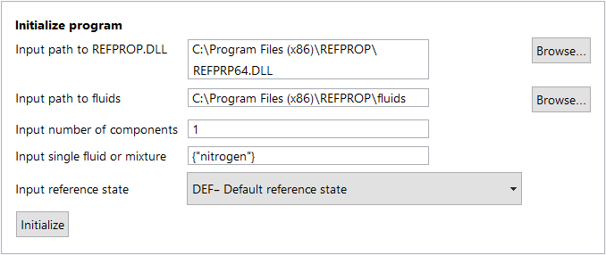

# TestRepo
This is a test repository for experimenting with Github and testing markdown and ReStructuredText files, specifically for CoolProp/CoolProp and CoolProp.IF97 repositories.  Nothing really useful here.

[Contributing](CONTRIBUTING.md)

[Test File #1](TEST1.md)

<details>
<summary># Using the Legacy (v9.x) API Functions</summary>

These steps in the instructions file noted above are also outlined below for completeness (outside of Mathematica) and for direct application in any Mathematica notebook (.nb) or WL script (.wls).

## Loading RefpropLink from within Mathematica

To call any of the RefProp functions, a WL session must be initialized (as explained in the RefpropLinkInstructions).

In any Mathematica session or script, the **NIST RefProp** functions are loaded by evaluating (`<Shift>+<Enter>`) the following command.
   ```Mathematica
   Needs["RefpropLink`"]
   ```
This command loads the RefpropLink context if it has not already been loaded.

## Setting Up a Fluid or Mixture

To use the RefProp functions, the first step is to call **_Setup_** to load a fluid or mixture from the **NIST RefProp** library.  **_Setup_** calls the function `SETUPdll()` from the installed `REFPROP64.DLL`.  Setup can be run in two ways:  

1. Using the [RFPI interactive form](#The-RFPI-Interactive-Form), or
2. [Calling **_Setup_** programmatically](#Calling-Setup-Programmatically).  

Both methods are shown below.

### The RFPI Interactive Form 

   The RefpropLink package includes an interactive form function, `RFPI[]`, to simplify calls to setup.  This is handy if the session is being run interactively in a notebook, but not as useful in a WL script.

   ```Mathematica
   RFPI[]
   ```
   The above command generates this interactive form:

   

   * The default paths of the installed `REFPROP64.DLL` and `fluids\` subfolder will be pre-populated, but can be changed if needed.  
   * For a single fluid, set the **number of components** to **1** and the **Input single fluid or mixture** field to `{fluidname.fld}`.  The example above uses this method to load the single pure-fluid file for `nitrogen`.
   * For mixtures, set the **Input single fluid or mixture** field as a list of comma separated strings.  For example: `{"fluid1.fld","fluid2.fld","fluid3.fld"}`.  Set the **Input number of components** fields to the appropriate number of fluids in the mixture.
   * The Reference state can be modified using the drop-down if needed.
   * Press the *Initialize* button to call **_Setup_** with the specified parameters.  
    
   > NOTE: The file `Filepaths.txt` in the RefpropLink installation folder contains two
   > two paths, separated by a semi-colon, to the installed REFPROP64.DLL file and the
   > installed fluids directory.  If RefProp is installed at a different location, these
   > path names should be modified for use as the defaults in the `RFPI[]` form.

### Calling Setup Programmatically

   Set all parameters up as strings and pass them to the `setup[]` function with a direct call.

   ```Mathematica
   (****************************************************************************)
   (*  For single fluid set fluidComponents as {"nameofluid.fld"}              *)
   (*  For mixtures, give the components of the mixture as a list of strings.  *)
   (*  Example: {"fluid1.fld","fluid2.fld","fluid3.fld"}                       *)
   (****************************************************************************)
   
   (*   Define parameter values for the call to Setup                          *)
   (****************************************************************************)
   dllpath = "C:\\Program Files (x86)\\REFPROP\\REFPRP64.DLL";
   fluidpath = "C:\\Program Files (x86)\\REFPROP\\fluids";
   fluidComponents = {"nitrogen.fld"};
   numberofComp = 1;
   refstate = "DEF";
   ierr = 0;
   herr = StringJoin[Table[" ", {256}]];
  
   (*   Call setup with the parameter values                                    *)
   (*****************************************************************************)
   setup[dllpath, fluidpath, fluidComponents, numberofComp, refstate, ierr, herr]
   ```
    
   A return value of _0_ indicates a successful call to **_setup_**.
   
   </details>
   
<details>
<summary># Using the New (v10) API Functions</summary>

These steps in the instructions file noted above are also outlined below for completeness (outside of Mathematica) and for direct application in any Mathematica notebook (.nb) or WL script (.wls).

## Loading RefpropLink from within Mathematica

To call any of the RefProp functions, a WL session must be initialized (as explained in the RefpropLinkInstructions).

In any Mathematica session or script, the **NIST RefProp** functions are loaded by evaluating (`<Shift>+<Enter>`) the following command.
   ```Mathematica
   Needs["RefpropLink`"]
   ```
This command loads the RefpropLink context if it has not already been loaded.

</details>
